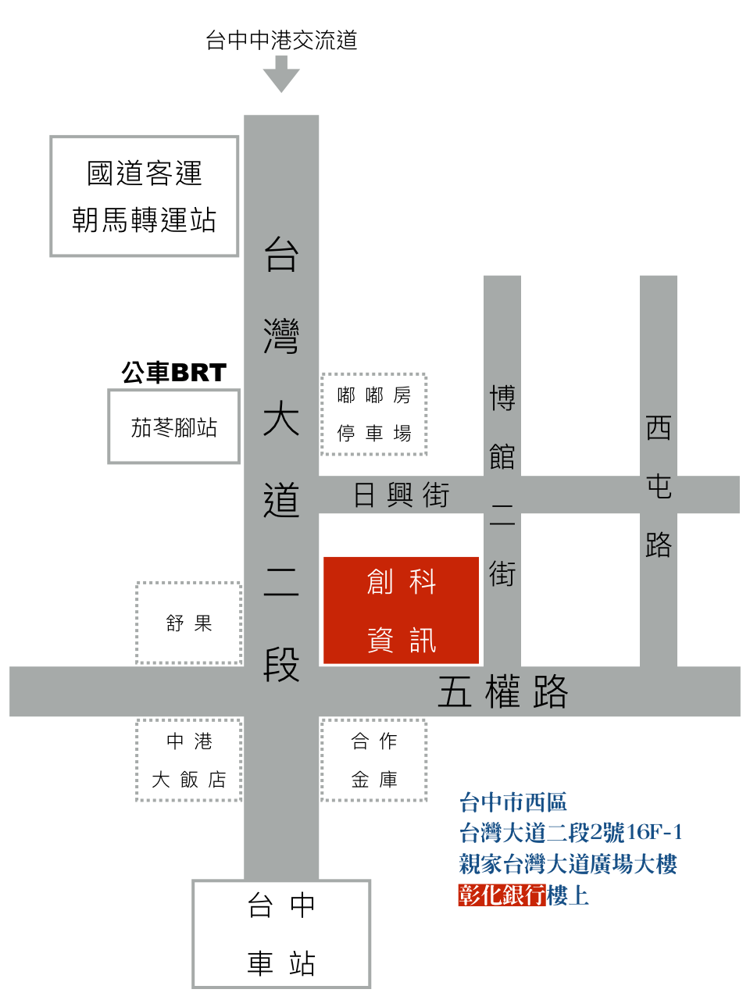

# 創科資訊股份有限公司

## 公司簡介

創科資訊股份有限公司創立於 2015 年，是一家年輕、充滿活力的新創公司，成立目的在於提供客戶高品質的軟體設計服務，不只是擁有專業技術，我們更有親切、誠懇的服務態度，完整考量客戶及使用者的需求共創多贏。

## 服務內容

AWS 雲端應用開發、響應式網頁設計、客製化軟體設計、企業管理系統開發、數位內容平台、軟體開發培訓

## 基本資料

統一編號：  54891351

公司名稱：  創科資訊股份有限公司

通訊地址：  403 台中市西區台灣大道二段2號16F-1

英文地址：  16F.-1, No.2, Sec. 2, Taiwan Blvd., West Dist., Taichung City 403, Taiwan (R.O.C.)

公司電話：  (04)2201-9020

傳真號碼：  (04)2393-5172

## 聯絡資訊

Kyle / kyle@trunksys.com / 0937-397377 / kyle@trunk-studio.com

## 交通地圖

位於台灣大道與五權路交叉路口，一樓是彰化銀行

【自行開車】

* 中山高：下台中交流道（原中港交流道）往台中市區約 10 ~ 15 分鐘，位於台灣大道與五權路交叉路口，一樓是彰化銀行
* 中投公路（台63）：下中投公路沿著五權南路直行約 10 分鐘至台灣大道與五權路口，一樓是彰化銀行
* 二高（南下）：下龍井交流道往台中市區方向接台灣大道,車程約 35 分鐘；位於台灣大道與五權路交叉口，一樓是彰化銀行
* 二高（北上）：先接中投公路;下中投公路沿著五權南路直行約 10 分鐘至台灣大道口，一樓是彰化銀行

註：汽車可停放嘟嘟房收費停車場

【台中車站】

* 台中公車 300 路（BRT）接駁至茄苳腳站，下車後步行約1分鐘可抵達
* 台中客運：57、88、106 可搭至中山醫院（台灣大道），前一站是中正原子街口
* 統聯客運：81、83、86、87，仁友東站(綠川東街)：45
* 計程車車程約 10 分鐘，車資約 $100 元

【高鐵】

* 台中市接駁公車搭往「台中公園路線」於科博館站下車，轉搭計程車約 $90 元；
* 或直接由高鐵搭計程車至中心，約 15 ~ 20 分鐘；車資約 $250 - $280 元
* 亦可由新烏日站搭乘台鐵電車至台中車站轉搭客運

【清泉崗機場】

* 搭計程車車程約 40 分鐘；車資約 $500 元

【ＵＢＥＲ】

* Uber 目的地搜尋「創科資訊」，即可搭乘 Uber 直接抵達。
* 從「台中火車站」到「創科資訊」搭乘 Uber 菁英優步約 NT$60-71 元。
